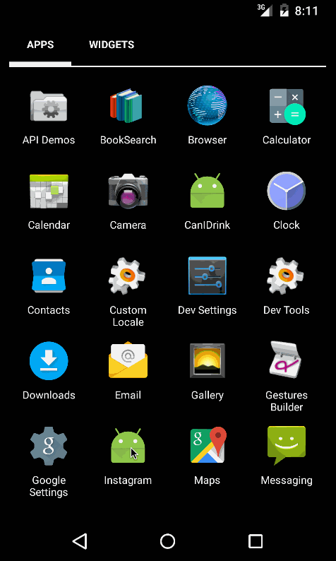

Android Instagram
=================
This is the starter project for the Instagram Client Project. 

Completed user stories:

Homework 1:
 * Time spent: 7 hours spent in total
 * [x] Required: User can scroll through current popular posts from Instagram.
 * [x] Required: For each post displayed, user can see the following details: (graphic, caption, username, user profile image, relative timestamp, like count)
 * [x] Required: Display each user profile image as a circle.
 * [x] Required: Display a nice default placeholder graphic for each image during loading.

Homework 2:
 * Time spent: 11 hours spent in total
 * [x] Required: Connect the app with the Instagram API and get real time data using the android-async-http library library.
 * [x] Required: Show the last 2 comments for each photo.
 * [x] Required: User can view all comments for an image within a separate activity.
 * [x] Required: User can share an image to their friends or email it to themselves.

Homework 3:
 * Time spent: 13 hours spent in total
 * [x] Required: User can login to Instagram using OAuth login.
 * [x] Required: User can view their own feed.
 * [x] Required: User can search for a user by username.
 * [x] Required: User can search for a tag.
 * [x] Optional: User can get a grid of photos by clicking on a search result (i.e. a user or tag).

## Video Walkthrough 

Here's a walkthrough of implemented user stories:

